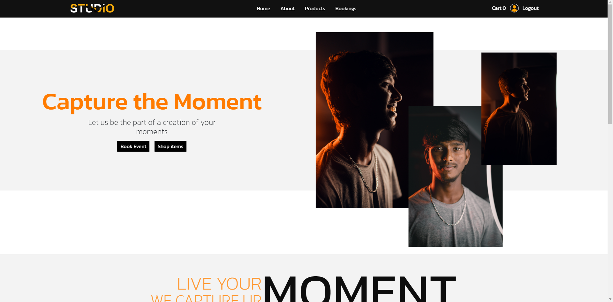
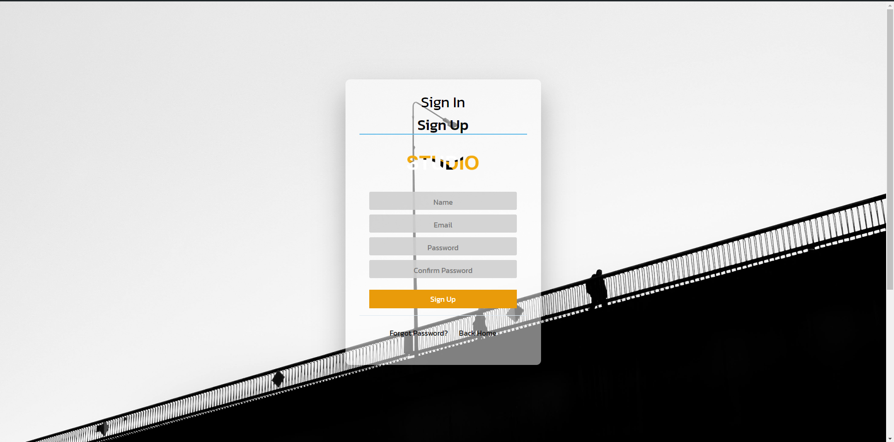
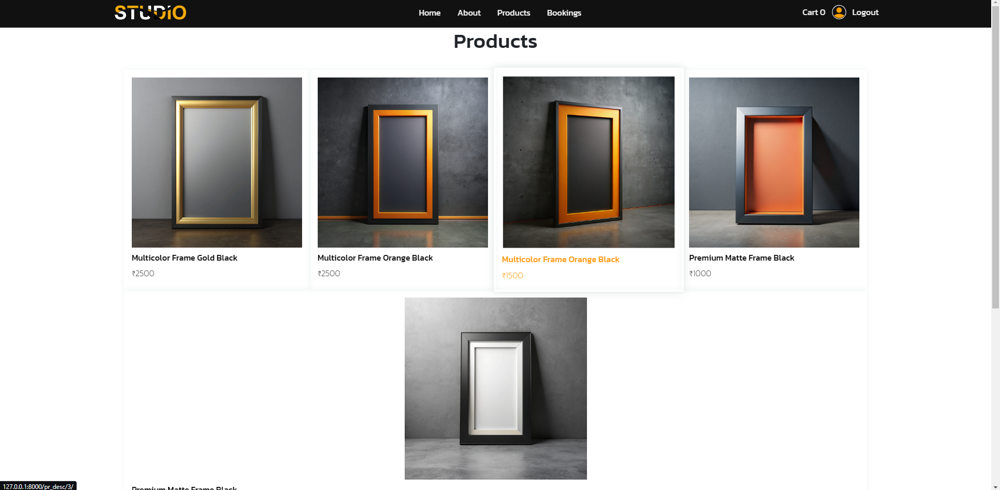
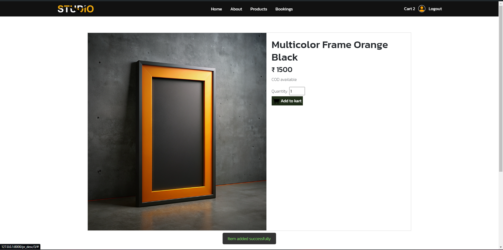
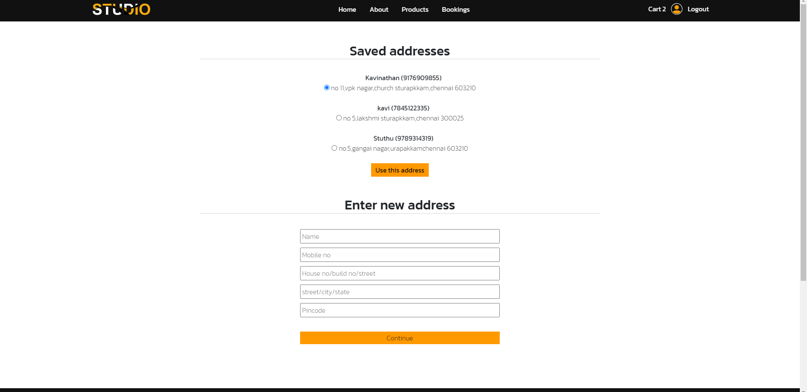

# Photography Studio Website
(Site is still in development)
This is a web application for a photography studio, built using Django, HTML, CSS, JavaScript, and MySQL. The website allows users to view the studio's portfolio, book appointments, and contact the studio.


*Homepage*


*Signup page*


*Product listing page*


*product description page*


*Address page*

## Table of Contents

- [Features](#features)
- [Technologies Used](#technologies-used)
- [Installation](#installation)
- [Usage](#usage)
- [Project Structure](#project-structure)
- [Contributing](#contributing)
- [License](#license)
- [Contact](#contact)

## Features

- Display portfolio of photography work
- Contact form for inquiries
- User authentication and profile management
- Admin panel for managing bookings and portfolio items

## Technologies Used

- **Backend:** Django
- **Frontend:** HTML, CSS, JavaScript
- **Database:** MySQL
- **Version Control:** Git and GitHub

## Installation

### Prerequisites

- Python 3.x
- Django
- MySQL
- Github


### Steps

1. **Clone the repository:**

   ```bash
   git clone https://github.com/yourusername/photography-studio-website.git
   cd photography-studio-website
